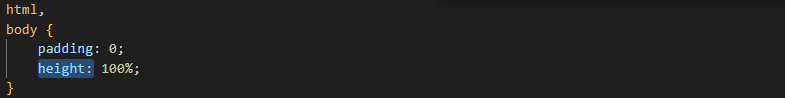
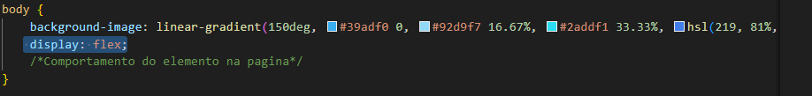
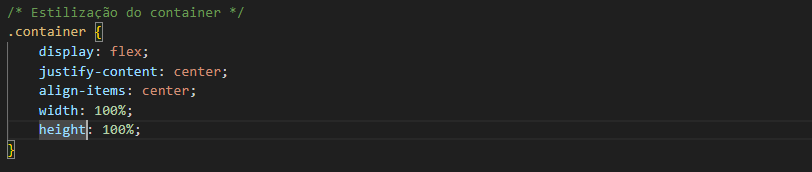
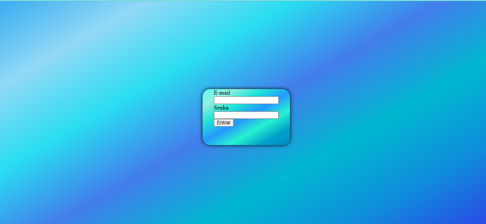

# Projeto - login
Projeto criado como parte avaliativa da disciplina de Fundamentos de Desenvolvimento ministrada 
pelo professor Leonardo Rocha.

## Índice 

* [Descrição](#descrição)
* [Referências](#Referências)
* [Autor(a)](#autor)
* [Tecnologias](#Tecnologias)

### Descrição 

 Este projeto é uma página de login simples, estilizada com CSS, projetada para ser usada como uma forma de autenticação básica.
 

  ### Estilização

 O projeto foi estilizado , utilizando CSS3. Foi criado um arquivo chamadi main.css. Nesse arquivo, constam configurações de estilo apresentadas a seguir:

 A baixo será possivel visualizar todos os elementos utilizados dentro do CSS

#### Tabela 

Este projeto inclui um formulário estilizado com uma tabela. Abaixo, você encontrará uma descrição detalhada sobre a parte da tabela, suas funcionalidades e como ela é integrada ao restante do projeto. 

*  `Padding:` A propriedade padding define uma a distância entre o conteúdo de um elemento e suas bordas. É um atalho que evita definir uma distância para cada lado separadamente ( padding-top , padding-right , padding-bottom , padding-left )

* `Height`: O atribuito height define o tamanho vertical ocupado por uma tag na tela do navegador. Esta dimensão incorpora todos os elementos internos do box model, incluíndo o atribuito padding e o atributo border.

Veja uma imagem do código, onde é possivel identificar o uso dos elementos mencionados acima:
 

*  `background-image:` A propriedade background-image é usada majoritariamente para adicionar imagens e até efeitos gradientes para o fundo de um elemento. Por ser uma propriedade da família dos fundos (background) pode ser usada em conjunto com outras propriedades como background-size, background-repeat e background-position, por exemplo. Esta localizado dentro do elemento <body>.

Veja a imagem a seguir onde é possivel ver o uso do td:

* `Display:` A função do display é possibilitar uma navegação personalizada ao usuário de acordo com a segmentação do projeto em que o dispositivo está sendo usado.

* `Justify-content:`O justify-content define o alinhamento das filhas ao longo do eixo principal. align-items define o comportamento padrão de como flex items são alinhados de acordo com o eixo vertical (cross axis). De certa forma, funciona de forma similar ao justify-content , porém no eixo perpendicular.

* `Align-items:` A propriedade CSS align-items estabelece o valor align-self em todos filhos diretos como um grupo. A propriedade align-self estabelece o alinhamento de um certo item dentro do bloco que o contém.

*  `Width:` A propriedade CSS width determina a largura da área de conteúdo de um elemento. A área de conteúdo fica dentro do preenchimento, da borda, e da margem de um elemento. As propriedades min-width e max-width sobrescrevem o width. 

Todos os elementos acima estão encontrados dentro da class ".container"

Veja a imagem seguir:

* `background-image:` A propriedade background-image é usada majoritariamente para adicionar imagens e até efeitos gradientes para o fundo de um elemento. Por ser uma propriedade da família dos fundos (background) pode ser usada em conjunto com outras propriedades como background-size, background-repeat e background-position, por exemplo.

*  `border-radius:` O border radius é uma propriedade CSS que permite adicionar cantos arredondados a um elemento, essa propriedade é usada para arredondar os cantos de um elemento especificado, ele pode ser aplicado a qualquer elemento HTML.

Os elementos acima estão encontrados dentro da class ".form"

Veja a imagem a segiir onde é possivel os elementos mencionados acima:

 
 *  `text-align:` center;: O método mais comum de centralizar texto horizontalmente é utilizando o “text-align”. Pois, essa propriedade também pode ser aplicada em um elemento pai para centralizar todo o conteúdo dentro dele, ou pode ser aplicada em um elemento filho para centralizar apenas o texto dentro desse elemento.

 Esta locxalizado dentro do elemento "h3"

 veja a imagem a seguir onde é possivel ver o elemento mencionado:
 

 ### Resultado do projeto 

## Tecnologias 

* HTML5
* CSS3
* Git
* Github
## Referências 

[Alura](https://www.alura.com.br/artigos/escrever-bom-readme) - Como escrever um README incrível no seu Github

## Autor(a)

 `O projeto foi desenvolvido por:`
 
 * Willian Baracho 
